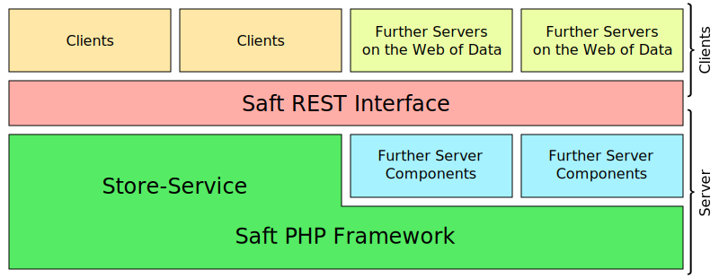

**Preliminaries:**

> For using Saft you should have a basic understanding of the [Resource Description Framework (RDF)](https://en.wikipedia.org/wiki/Resource_Description_Framework), [SPARQL](https://en.wikipedia.org/wiki/SPARQL) and the idea of the [Semantic Web](https://en.wikipedia.org/wiki/Semantic_Web).

You have reached the documentation of the Saft project. Here you will find information about the Saft PHP framework itself, the Saft REST interface and how to constribute to the project. If you have a question, don't hesitate to open a [new issue](https://github.com/SaftIng/Saft/issues/new).

## Saft PHP framework

<a class="btn" href="phpframework">more information</a>

The Saft PHP Framework consists of the *Saft Library* and the *Saft Skeleton Application*.

### Implementation Conventions

<a class="btn" href="phpframework/implementation-conventions">more information</a>

We use certain conventions, when building Saft components. Please have them in mind, when you constribute code or develop for/based on Saft.

## Saft REST interface

<a class="btn" href="restinterface">more information</a>

_Saft_ is a framework with the aim to specify components needed for software engineers to easily implement web applications using Semantic Web technology.
For the interface towards the World Wide Web a [REST interface is specified](restinterface).
It allows read and write access to the data served by a Store-Service.
For server side implementation of Semantic Web applications, e.g. implementing a Store-Service for the World Wide Web, we provide the [Saft PHP framework](phpframework).

## Application Programming Interface

_Saft_ provides an _Application Programming Interface (API)_ which can be used by application developers to use and extend the provided library resp. framework.
The API consists of all classes and methods tagged with the `@api` tag ([FIG-5 @api](https://github.com/phpDocumentor/fig-standards/blob/master/proposed/phpdoc.md#81-api)). To identify the version when the class or method was introduces or changed the `@since` tag is used together with the according API-version ([FIG-5 @since](https://github.com/phpDocumentor/fig-standards/blob/master/proposed/phpdoc.md#817-since)). Deprecated methods are marked with `@deprecated` ([FIG-5 @deprecated](https://github.com/phpDocumentor/fig-standards/blob/master/proposed/phpdoc.md#85-deprecated)).

<a class="btn" href="apiinfo">API classes and method</a>

## Contribution

You are very welcome to contribute to the _Saft_ project! You can help us by forking our repositories and sending pull requests via Github to improve the code or the documentation.

### Code Conventions

If you are changing the code please respect our [conventions regarding coding style, conding standard and the names](phpframework/conventions). We provide tools that help you to match most of our coding standards. Please have a look into the [Makefile](https://github.com/SaftIng/Saft/blob/master/Makefile).

### Contribute to the Documentation
This is the documentation for _Saft_. If you want to contribute to the documentation (even if it is just a typo) please feel free to fork the [site and documentation repository](https://github.com/SaftIng/safting.github.io) and create a pull request.
