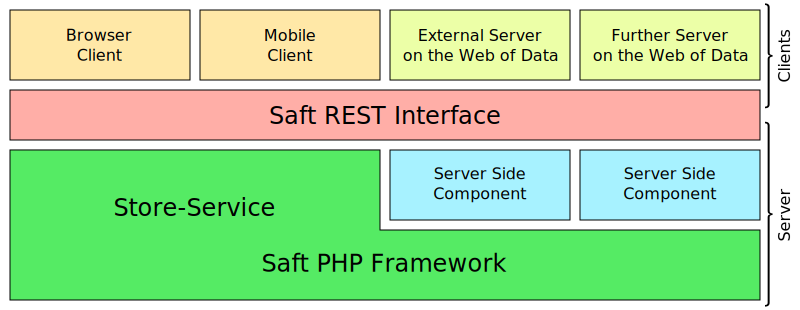

## Preliminaries

For using Saft you should have a basic understanding of the [Resource Description Framework (RDF)](https://en.wikipedia.org/wiki/Resource_Description_Framework), [SPARQL](https://en.wikipedia.org/wiki/SPARQL) and the idea of the [Semantic Web](https://en.wikipedia.org/wiki/Semantic_Web).

## Structure of Saft

<a class="btn" href="restinterface">Saft REST interface</a>
<a class="btn" href="phpframework">Saft PHP framework</a>

_Saft_ is a framework with the aim to specify components needed for software engineers to easily implement web applications using Semantic Web technology.
For the interface towards the World Wide Web a [REST interface is specified](restinterface).
It allows read and write access to the data served by a Store-Service.
For server side implementation of Semantic Web applications, e.g. implementing a Store-Service for the World Wide Web, we provide the [Saft PHP framework](phpframework).

## Other Artefacts

The [Logo](logo):

## Contribution

### Conventions
You are welcome to contribute to the source code of _Saft_ by forking our repositories and sending pull requests via github.
If you are changing the code please also respect our [conventions regarding coding style, conding standard and the names](phpframework/conventions).

### Documentations
This is the documentation for _Saft_. If you want to contribute to the documentation (even if it is just a typo) please feel free to fork the [site and documentation repository](https://github.com/SaftIng/safting.github.io) and create a pull request.
