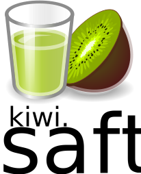

# Logo

The _Saft_ contains a glass of juice (German: “Saft”) with an altering flavor and fruit beside it, the project name is prefixed with the flavor and is printed somewhere next to the glass and fruit. The flavor indicates the projects current version.

## Flavors

<table>
<tr><th>version</th><th>flavor</th><th>explanation </th></tr>
<tr><td><em>work in progress</em>; 0.1</td><td>kiwi</td><td>because it is green and green is a color for growing and not yet ready things</td></tr>
</table>

## Examples

The logo with the project name and flavor in [Fira Sans](https://en.wikipedia.org/wiki/Fira_Sans), once with freestanding flavor and once with the flavor text intersected with the project name.

The logo with the project name and flavor in [Open Sans](https://en.wikipedia.org/wiki/Open_Sans), once with freestanding flavor and once with the flavor text intersected with the project name.

Another variant of the logo.

## Source of the logo parts and license

[Tango-juice.svg](https://commons.wikimedia.org/wiki/File:Tango-juice.svg) and [Kiwi.svg](https://commons.wikimedia.org/wiki/File:Kiwi.svg).
The files are licensed under the Creative Commons [Attribution-Share Alike 3.0 Unported](https://creativecommons.org/licenses/by-sa/3.0/deed.en) resp.  Creative Commons Attribution-Share Alike [2.5 Generic](https://creativecommons.org/licenses/by-sa/2.5/deed.en), [2.0 Generic](https://creativecommons.org/licenses/by-sa/2.0/deed.en) and [1.0 Generic](https://creativecommons.org/licenses/by-sa/1.0/deed.en) license.
So our logo is also licensed under the CC-by-sa license (don't know which version) and we have to attribute [C Stark aka DarKobra](http://darkobra.deviantart.com/), [Murielmarc](https://commons.wikimedia.org/wiki/User:Murielmarc) and [André Karwath aka Aka](https://commons.wikimedia.org/wiki/User:Aka).

For adjusting the colors in Tango-juice.svg I've done the following color substitutions in the SVG file: d1ba03 -> 3bba03, fce52a -> 3be52a and 8e7f02 -> 3b7f02. Maybe the color should better fit to the kiwi next to it :-D
